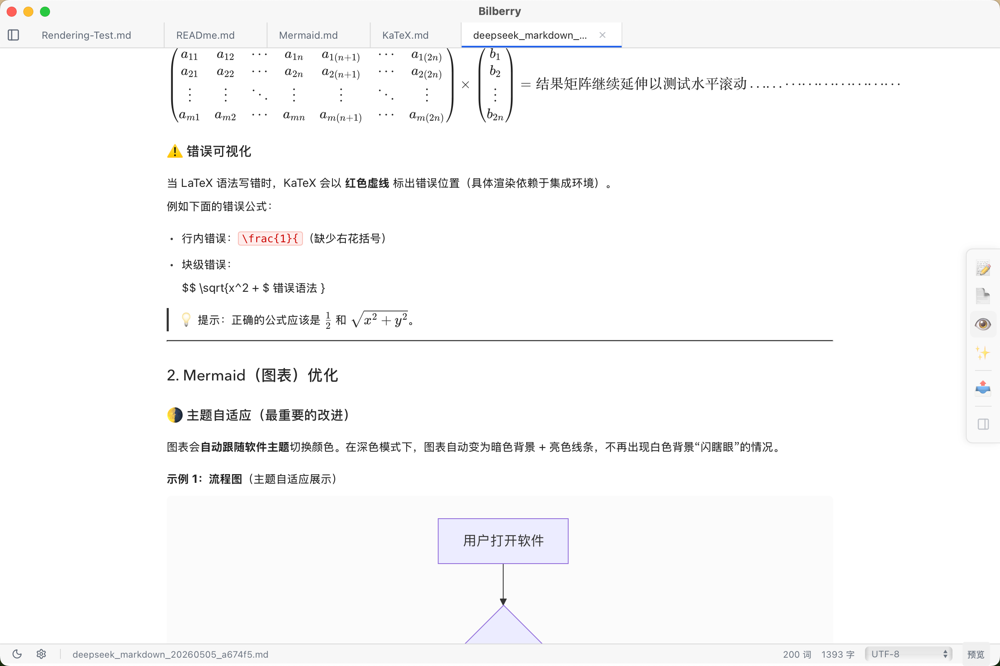

# Bilberry

A desktop Markdown note editor built with **Tauri 2**, **Svelte 5**, and **Rust**.



## Features

- **Vault-based organization** — Open/create vault directories, browse `.md` files in a file tree
- **Multi-mode editor** — Preview, Source (CodeMirror 6), Split (editor + preview side-by-side), and Live modes
- **Markdown rendering** — GFM via `marked`, with KaTeX math (`$...$` / `$$...$$`) and Mermaid diagram support
- **Full-text search** — Powered by Tantivy, with snippet previews
- **WikiLinks** — `[[link]]` and `[[link|alias]]` syntax support
- **Multi-encoding support** — Open and save files in UTF-8, GB18030, Big5, Shift_JIS, Windows-1252, and more
- **Export to HTML** — Single-file styled HTML export
- **Dark/Light theme** — Toggle with persistent preference
- **No external dependencies** — No Node.js backend, no database server; fully self-contained

## Screenshots

> *(Coming soon)*

## Quick Start

## Debian or Ubuntu
`sudo apt install libglib2.0-dev`
`sudo apt install libgtk-3-dev`
`sudo apt install libjavascriptcoregtk-4.1-dev`
`sudo apt install -y libsoup-3.0-dev libwebkit2gtk-4.1-dev`

```bash
# Install dependencies
npm install

# Start dev server (Vite + Tauri window)
npm run tauri dev

# Production build
npm run tauri build
```

The built application will be at:
- `src-tauri/target/release/bundle/macos/Bilberry.app` (macOS)
- `src-tauri/target/release/bundle/dmg/Bilberry_0.1.0_aarch64.dmg` (installer)

## Development

```bash
# Frontend-only dev (browser)
npm run dev

# Rust type check (faster than full build)
cd src-tauri && cargo check

# Run Rust tests
cd src-tauri && cargo test

# Svelte diagnostics
npx svelte-check
```

## Architecture

```
┌─────────────────────────────────────────────────┐
│  Frontend (Svelte 5 + TypeScript)               │
│                                                  │
│  Layout → Sidebar           EditorPanel          │
│           ├─ FileExplorer   ├─ Editor (CM6)      │
│           └─ SearchPanel    └─ Preview            │
│                                                  │
│  Stores: vault / editor / theme / settings       │
│  └── invoke() calls ──→ Tauri IPC bridge         │
├─────────────────────────────────────────────────┤
│  Backend (Rust)                                  │
│                                                  │
│  commands/          vault/     search/           │
│  ├─ vault_commands  ├─ create  ├─ schema         │
│  ├─ notes_commands  ├─ open    ├─ index          │
│  └─ knowledge       └─ scan    └─ search         │
│                                                  │
│  wikilink/          export/                      │
│  └─ parser          └─ html_gen                  │
└─────────────────────────────────────────────────┘
```

**Key technology choices:**
- **Tauri 2** — Desktop shell with IPC between frontend and Rust backend
- **Svelte 5** — UI framework with runes (`$state`, `$derived`, `$effect`, `$props`)
- **CodeMirror 6** — Extensible code editor for source mode
- **Tantivy** — Full-text search engine (Rust)
- **pulldown-cmark** — Markdown→HTML (for export)
- **marked** — Client-side markdown rendering (for preview)
- **KaTeX** — Math typesetting in preview
- **Mermaid** — Diagram rendering in preview
- **encoding_rs** — Multi-encoding file read/write

## Usage

1. Launch Bilberry
2. Create or open a **Vault** (a directory containing `.md` files)
3. Click a file in the sidebar to open it
4. Use the toolbar to switch between **Preview**, **Source**, **Split**, or **Live** modes
5. Use **Cmd+P** for quick file search *(coming soon)*

## License

MIT